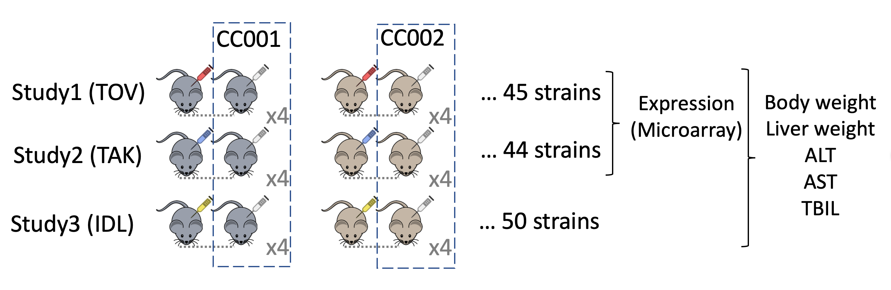

This is a code repository for the manuscript 'Replicability and reproducibility of genetic analysis between different mice liver studies using the Collaborative Cross'

# Study Introduction
Replicability of experiments is an essential part of the scientific method. By combining research records from several large scale genetics experiments in panels of inbred mice strains (the Collabrative Cross, CC) with mostly identical designs, we have a dataset that to a large extent mimics the process of strict replication.
From this dataset, we applied replicability comparison of both phenotypic and expression data.


Three studies were originally designed to invest drug induced liver injury of three different drugs (Coded as: TOV, TAK and IDL study). 
The control CC mice from the three studies underwent very similar experiments of vehicle-only dosing. The uniformity of experiments, together with genetically identical inbred subjects, makes these studies been considered independent replicating experiments on identical subjects.
Body weight and liver related phenotype are measured. Microarray expression is measured in the TOV and TAK data.

# Files

```R
phenotype.R
```

